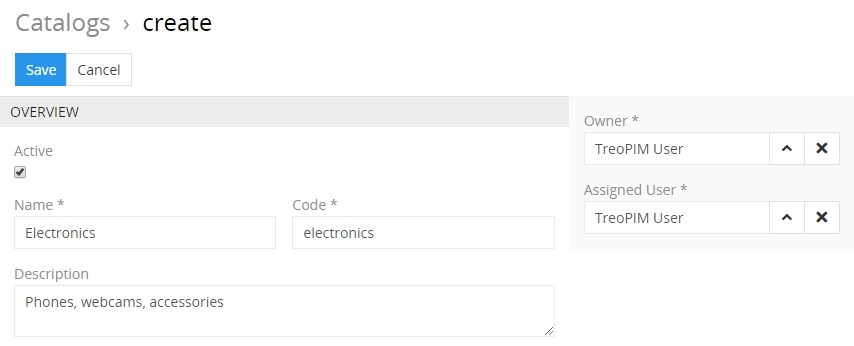
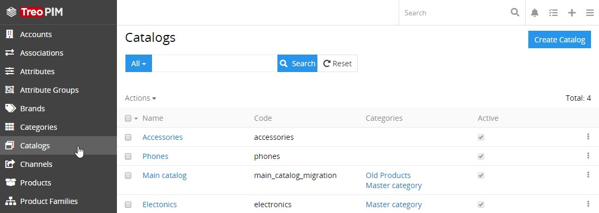
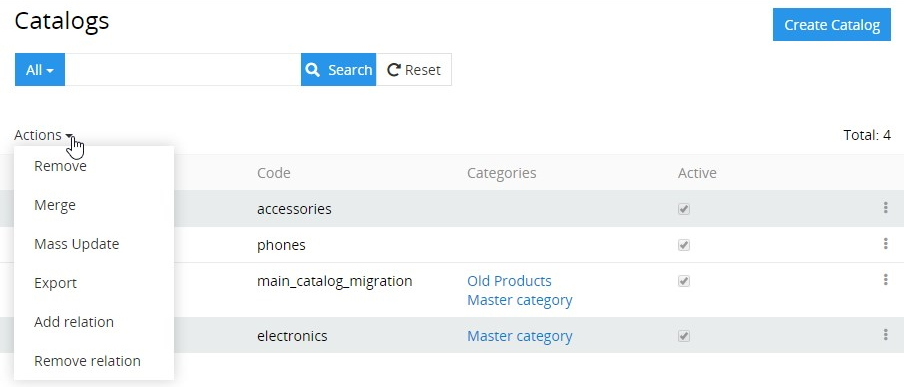
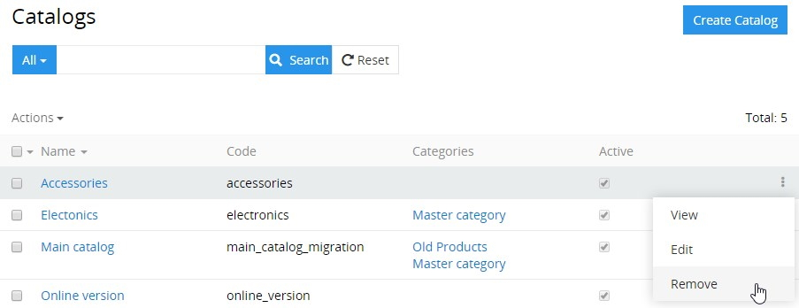
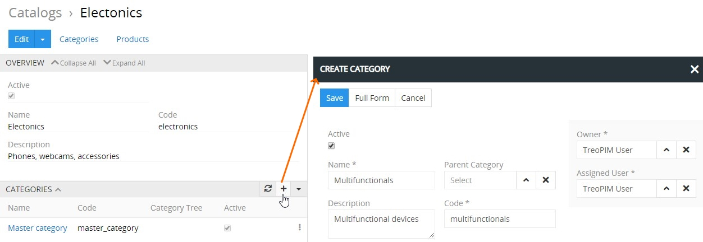
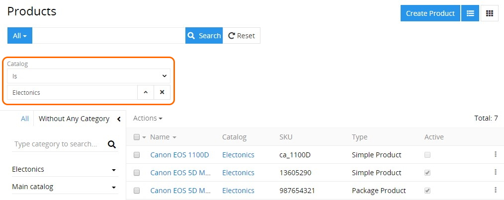

# CATALOGS

**Catalog** – a container for your [products](https://treopim.com/help/products) arranged by certain criteria, i.e. it is a set of data at a given time compiled to be transferred via certain [channels](https://treopim.com/help/channels). Catalog's content may be modified whenever needed within the TreoPIM system.

Catalogs, as well as channels, form the basis of the multichannel publication of your products data. They allow you to manage your range of products and carry out your multichannel strategy in the most flexible manner.

With the help of catalogs you can create as many versions of your products as you need, preserving the ability to modify your data within your company exclusively and not worrying about possible changes made by your suppliers during the data transfer.

The catalog structure can be different for each user, based on their needs. For instance, catalogs can be used to segment your range of products for further export of the product data to certain channels, as well as to store historical information about your products (e.g. "Winter jackets 2019" and "Winter jackets 2020").

The multi-catalog function is beneficial both for manufacturers, wholesalers, and retailers due to its ability to meet all their specific needs and requirements. For instance, manufacturers can easily enlarge/shorten their range of products on the basis of their already existing catalog(s). At the same time, wholesalers or retailers get a powerful tool to organize and systematize all the product information collected from different sources into one proper master catalog (and then create as many versions of it as needed) in a very flexible manner. There is no need to spend much time on creating a brand new catalog from scratch – just edit what you already have with the help of the TreoPim multi-catalog feature!

## Catalog Fields

The catalog entity comes with the following preconfigured fields; mandatory are marked with *:

| **Field Name**			| **Description**                   |
|---------------------------|-----------------------------------|
| Active					| Activity state of the catalog record          |
| Name (multi-lang) *		| Catalog name                     |
| Category *				| Category name this catalog must be assigned to            |
| Description (multi-lang)  | Description of the catalog usage    |

If you want to make changes to the catalog entity (e.g. add new fields, or modify catalog views), please contact your administrator.

## Creating 

To create a new catalog, click `Catalogs` in the breadcrumb navigation or in the navigation menu to get to the catalogs [list view](#listing), and then click the `Create Catalog` button. The common creation window will open:

Here enter the desired name for the catalog being created and activate it, if needed. Its code is automatically generated based on the entered name, but you can change it via the keyboard. Also select the catalog owner and assigned user from the corresponding lists. The catalog description is an optional field and can be left empty.

Please, consider giving your catalog a clear name that will help you quickly identify its destination and target audience.

Click the `Save` button to finish the catalog creation or `Cancel` to abort the process. 

If the catalog code is not unique, the error message will appear notifying you about it.

The new record will be added to the catalogs list. You can configure it right away on the detail view page that opens or return to it later.

Alternatively, use the quick create button on any TreoPIM page and fill in the required fields in the catalog creation pop-up that appears:

## Listing

To open the list of catalogs available in the system, click the `Catalogs` option in the navigation menu:

By default, the following fields are displayed on the [list view](https://treopim.com/help/views-and-panels) page for catalogs:

- Name
- Code
- Categories
- Active

To change the catalog records order in the list, click any sortable column title; this will sort the column either ascending or descending. 

Catalogs can be searched and filtered according to your needs. For details on the search and filtering options, refer to the [**Search and Filtering**](https://treopim.com/help/search-and-filtering) article in this user guide.

To view some catalog record details, click the name field value of the corresponding record in the list of catalogs; the detail view page will open showing the catalog records and the records of the related entities. Alternatively, use the `View` option from the single record actions menu to open the [quick detail](https://treopim.com/help/views-and-panels) pop-up.

### Mass Actions

The following mass actions are available for catalog entities on the list view page:

- Remove
- Merge
- Mass update
- Export
- Add relation
- Remove relation

For details on these actions, refer to the **Mass Actions** section of the [**Views and Panels**](https://treopim.com/help/views-and-panels) article in this user guide.

### Single Record Actions

The following single record actions are available for catalog entities on the list view page:

- View
- Edit
- Remove

For details on these actions, please, refer to the **Single Record Actions** section of the [**Views and Panels**](https://treopim.com/help/views-and-panels#single-record-actions) article in this user guide.

## Editing 

To edit the catalog, click the `Edit` button on the detail view page of the currently open catalog record; the following editing window will open:

Here edit the desired fields and click the `Save` button to apply your changes.

Besides, you can make changes in the catalog record via [in-line editing](https://treopim.com/help/views-and-panels) on its detail view page.

You can also manage [categories](#categories) and [products](#products) related to the catalog. The details are given later in this article.

Alternatively, make changes to the desired catalog record in the [quick edit](https://treopim.com/help/views-and-panels) pop-up that appears when you select the `Edit` option from the single record actions menu on the catalogs list view page:

## Removing

To remove the catalog record, use the `Remove` option from the actions menu on its detail view page

or from the single record actions menu on the catalogs list view page:

When you are trying to remove a catalog that contains products in it, the following confirmation message appears:

Click the `Remove` button to complete the operation or `Cancel` to abort it.

## Duplicating

Use the `Duplicate` option from the actions menu to go to the catalog creation page and get all the values of the last chosen catalog record copied in the empty fields of the new catalog record to be created. Modifying the catalog code is required, as this value has to be unique.

As a result, the catalog is 100% duplicated together with all its products.

## Working With Entities Related to Catalogs

Relations to [categories](https://treopim.com/help/categories) and [products](https://treopim.com/help/products) are available for all catalogs by default. The related entities records are displayed on the corresponding panels on the catalog [detail view](https://treopim.com/help/views-and-panels) page. If any panel is missing, please, contact your administrator as to your access rights configuration.

To be able to relate more entities to the catalog, please, contact your administrator.

### Categories

Categories that are linked to the catalog are shown on the `CATEGORIES` panel within the catalog detail view page and include the following table columns:
 - Name
 - Code
 - Category tree
 - Active

On this panel, you can link categories to the given catalog by selecting the existing ones or creating new categories.

To create new categories, click the `+` button located in the upper right corner of the `CATEGORIES` panel and enter the necessary data in the category creation pop-up that appears:

Click the `Save` button to complete the category creation process or `Cancel` to abort it.

To assign an existing category (or several categories) to the catalog, use the `Select` option from the actions menu  of the `CATEGORIES` panel:

In the "Categories" pop-up that appears, choose the desired category (or categories) from the list and press the `Select` button to link the item(s) to the catalog.

Please, note that only root categories should be linked to the catalogs, which means that all catalog products may have only those categories that are related to the selected category tree(s).

Categories linked to the given catalog can be viewed, edited, unlinked or removed via the corresponding options from the single record actions menu on the `CATEGORIES` panel:

### Products

Products that are linked to the catalog are displayed on its detail view page on the `PRODUCTS` panel and include the following table columns:
 - Name
 - SKU
 - Type
 - Active

To see all products linked to the given catalog, use the `Show full list` option:

Then the "Products" page opens, where all product records [filtered](https://treopim.com/help/search-and-filtering) by the given catalog are displayed:

To view the catalog related product, click its name in the products list. The [detail view](https://treopim.com/help/views-and-panels) page of the given product will open, where you can perform further actions according to your access rights, configured by the administrator. 

